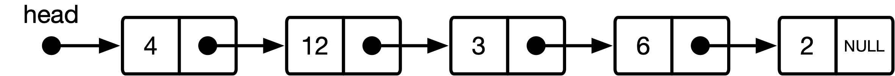
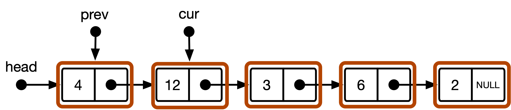
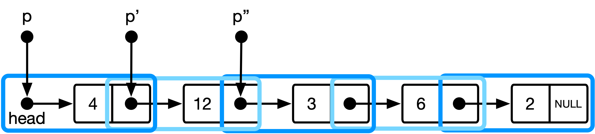

# linked-list-good-taste 中文说明版

来源仓库：<https://github.com/mkirchner/linked-list-good-taste>

说明：本文档是对原 README 的中文讲解与结构化整理，不是逐句直译版。核心内容是解释 Linus Torvalds 提到的单链表删除操作，以及为什么“pointer to pointer”写法更有“代码品味”。

## 背景

Linus Torvalds 在一次访谈中谈到“code good taste”时，举了一个很经典的[例子](https://www.ted.com/talks/linus_torvalds_the_mind_behind_linux) (14:10)：从单链表中删除一个给定节点。

这个例子的重点不在于“能不能删掉节点”，而在于：

- 代码是否把本来可以统一处理的问题拆成了特殊情况
- 数据结构的本质是否在代码中被准确表达出来
- 删除操作真正修改的对象到底是什么

## 问题定义

假设我们有一个单链表，以及一个待删除的目标节点 `entry`。目标是在链表中找到它，并把它从链表中摘掉。

图示：



## 常见写法：保存前驱节点

很多教材或初学者会写出类似下面的思路：

1. 用 `cur` 遍历链表，找到目标节点。
2. 同时用 `prev` 记录前驱节点。
3. 删除时分两种情况：
   - 如果 `prev != NULL`，说明删的是中间或尾部节点，执行 `prev->next = cur->next`
   - 如果 `prev == NULL`，说明删的是头节点，执行 `head = cur->next`

示意图：



这种写法可以工作，但它有一个明显特点：头节点被当成特殊情况单独处理。

这意味着：

- 代码里出现了额外分支
- “删除头节点”和“删除普通节点”不是同一种操作
- 代码表达的是控制流分叉，而不是链表链接关系的统一性

```c
void remove_cs101(list *l, list_item *target)
{
        list_item *cur = l->head, *prev = NULL;
        while (cur != target) {
                prev = cur;
                cur = cur->next;
        }
        if (prev)
                prev->next = cur->next;
        else
                l->head = cur->next;
}
```

## 更好的写法：pointer to pointer

原仓库给出的“更优雅”版本是：

```c
void remove_elegant(list *l, list_item *target)
{
        list_item **p = &l->head;
        while (*p != target)
                p = &(*p)->next;
        *p = target->next;
}
```

示意图：



这段代码最关键的地方，是把遍历对象从“节点”换成了“指向节点的那个指针”。

`p` 的类型是 `list_item **`，也就是“指针的指针”。它不是在链表里直接走节点，而是在沿着这些“链接位置”前进：

- 初始时，`p = &l->head`，表示它指向头指针本身
- 如果目标不是当前节点，就执行 `p = &(*p)->next`
- 这表示让 `p` 前进到下一个链接位置，也就是当前节点的 `next` 字段

所以，`p` 始终表示：

“当前这个位置上的指针变量，它正在指向哪个节点？”

换句话说，`*p` 才是当前节点指针，而 `p` 是这个节点指针所在的位置。

当循环停下来时：

```c
while (*p != target)
        p = &(*p)->next;
```

其含义不是“找到了目标节点本身”，而是：

“找到了那个正在指向 `target` 的链接位置。”

这个链接位置可能是：

- `l->head`
- 某个前驱节点的 `next`

一旦找到，删除就变成：

```c
*p = target->next;
```

这句的意思是：把原本指向 `target` 的那个链接，改成指向 `target->next`。

如果 `p == &l->head`，这句等价于：

```c
l->head = target->next;
```

如果 `p == &prev->next`，这句等价于：

```c
prev->next = target->next;
```

这就是它优雅的地方：无论删的是头节点还是普通节点，代码都完全一样，不需要 `if` 去区分特殊情况。

## 为什么这种写法更有“代码品味”

### 1. 它消除了头节点特判

在普通写法里，删除头节点要单独判断。

而在 `pointer to pointer` 写法里，`head` 和 `prev->next` 被统一看作“一个链接位置”。删除时改写这个链接位置即可，不需要分支。

### 2. 它直接操作真正需要修改的对象

删除一个节点时，真正要修改的不是“当前节点”本身，而是“指向它的那个链接”。

普通写法中，你先保存 `prev`，再间接修改 `prev->next` 或 `head`。

`pointer to pointer` 写法则直接把这个“待修改的链接位置”表示出来，因此代码更贴近问题本质。

### 3. 它让控制流更统一

普通写法：

- 遍历时关注 `cur`
- 删除时又要回到 `prev`
- 头节点还要额外处理

`pointer to pointer` 写法：

- 遍历和删除都围绕同一个量 `p`
- 找到目标后不需要判断是否在头部
- 删除语句始终相同

## 按这段代码理解

可以把这段实现拆成三句话来理解：

1. `list_item **p = &l->head;`
   从头指针这个“链接位置”开始扫描。

2. `p = &(*p)->next;`
   如果当前位置指向的还不是目标，就移动到下一个链接位置。

3. `*p = target->next;`
   一旦当前位置正好指向目标节点，就把这个位置改写为目标节点的后继，从而把目标节点摘掉。

所以它删除的不是“当前节点变量”，而是“指向目标节点的那个指针槽位”。

## 这个例子的核心启发

这个例子真正想表达的不是某个 C 语法技巧，而是一种建模习惯：

- 不要急着给特殊情况加分支
- 先看能否把“特殊情况”纳入同一个数据模型
- 如果一个问题可以被统一表达，代码通常会更短、更稳、更清楚

对于单链表删除来说，“头指针”和“前驱节点的 next 指针”本质上都是链接的一部分。只要代码能把这一点表达出来，很多分支自然就消失了。
