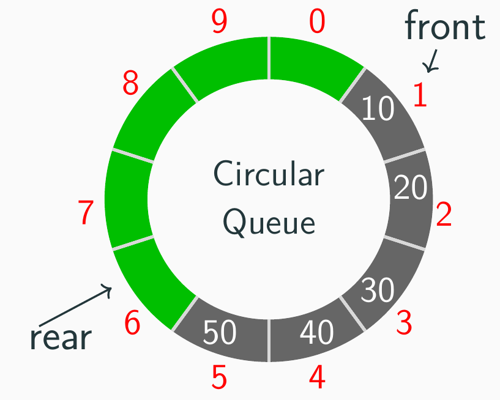

# 第3章：栈与队列

## 3.1 

`GetTop`操作也一般被称为`peek`。

教材中很多关于C++的引用（`&`）操作实际是没有必要的（第2章也有类似情况）。以典型的`pop`操作为例，只用指针就够了：

```c
bool stack_pop(Stack *stack, ElemType *result) {
  if (stack_is_empty(stack)) {
    return false; // Stack underflow
  }
  *result = stack->data[stack->top--];
  return true;
}
```

而教材中则使用`Stack *&stack`，这在C++中是合法的，但在这里并没有什么实际意义；除非代码中需要修改`stack`指针本身（比如重新分配内存），否则使用普通的指针就足够了。

> 为了使用 Pure C，后续不再讨论 C++ 的引用语法。


后缀表达式的求解非常经典。但是由于C语言中并没有原生的字符串类型，在操作的时候稍显麻烦，比如不像Java/Python等语言方便地分隔字符串。`strtok`函数可以完成这个目的：

```c
#include <stdio.h>
#include <string.h>

void split(char *s) {
    char *token = strtok(s, " ");
    while (token != NULL) {
        printf("%s\n", token);
        token = strtok(NULL, " ");
    }
}

int main(void) {
    char str[] = "hello world this is C";
    split(str);
    return 0;
}
```

另一方面，如何高效求解有括号的中缀表达式`( 1 + ( ( 2 + 3 ) * ( 4 * 5 ) ) )`的值呢？E.W.Dijkstra提出了著名的**双栈算法**，使用一个栈存储操作数，另一个栈存储运算符。算法的核心思想是：*当遇到一个操作数时，将其压入操作数栈；当遇到一个运算符时，将其压入运算符栈；当遇到一个右括号时，从运算符栈中弹出一个运算符，并从操作数栈中弹出两个操作数，进行计算后将结果压回操作数栈*。


### Stack in Computer Systems

在计算机系统中，**栈**是一个非常重要的数据结构，主要用于函数调用和局部变量的管理。每当一个函数被调用时，系统会为该函数分配一个新的栈帧（`stack frame`），其中包含了函数的参数、局部变量以及返回地址。当函数执行完毕后，栈帧会被销毁，返回地址会被使用来继续执行调用函数的代码。

## 3.2

对于循环队列，另外一种关于`front`和`rear`的定义是：**front指向队头元素，rear指向队尾元素的下一个位置**。

