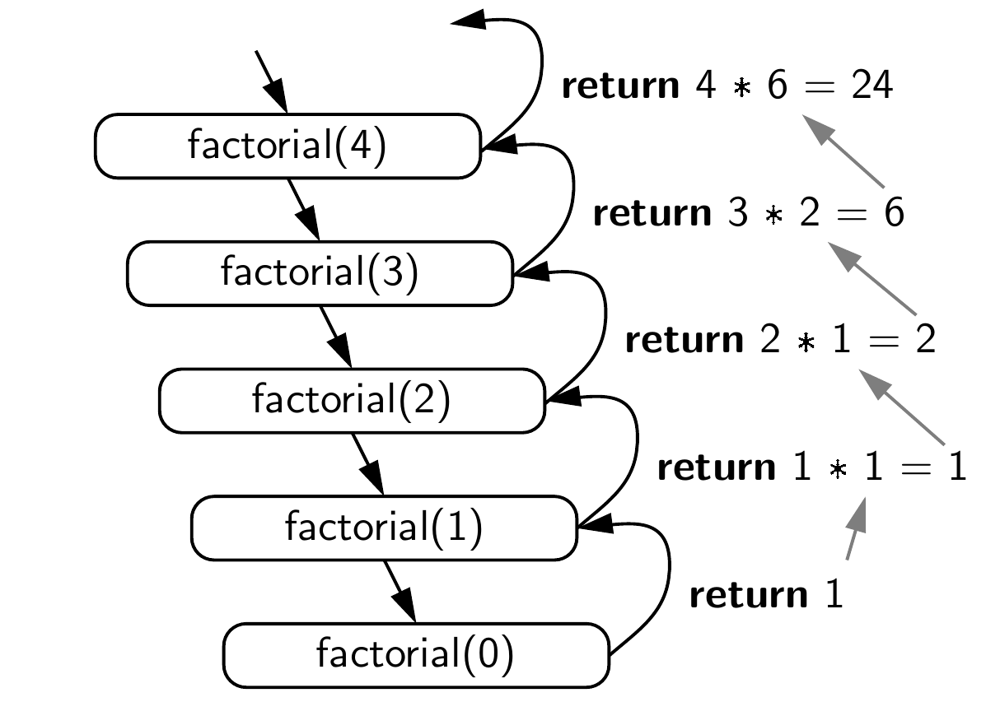
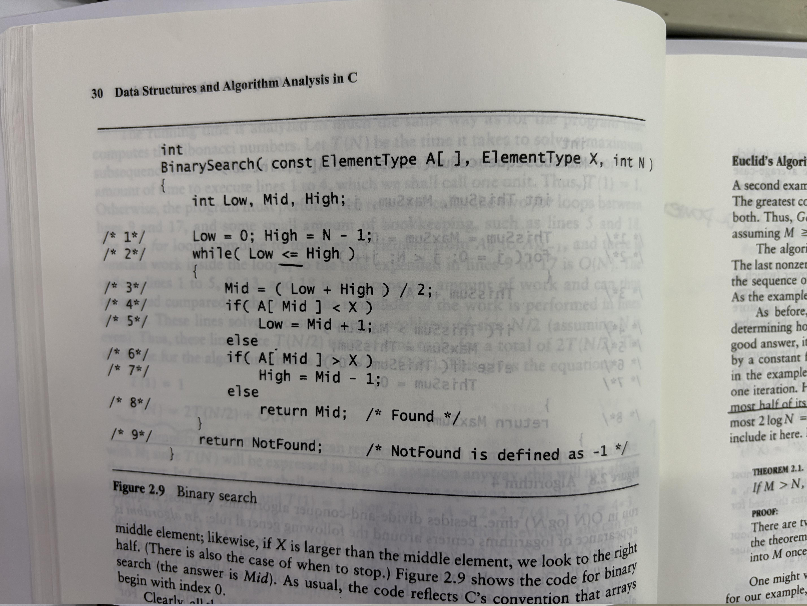

# 第5章: 递归

> 递归被广泛应用在树等复杂数据结构中，也是很多高级算法（如分治算法）的核心思想。

> 递归是很多函数式编程（Functional Programming）语言的核心特征。

> [!IMPORTANT]
> Recursion occurs when the definition of a concept or process depends on a simpler or previous version of itself.

## 5.1

P.142提到的递归出口在很多书中被称为**基线条件**（Base Case），它是递归函数中不再调用自身的条件。基线条件是递归函数正确终止的关键；递归体则被称为**Recursive Case**，它是递归函数中调用自身（更小）的部分。

因此，一个*合法*递归程序有两种基本条件：

- Base Step：有终止（不继续递归）
- Recursive Step：在更小的问题上递归调用（it makes progress towards the base case）


下面的代码为什么不合法？

```c
int bad(unsigned int n) {
    if (n == 0) {
        return 0;
    }
    return bad(n / 3 + 1) + n - 1;
}
```

进一步，一个*好*的递归程序的子问题不应该有重叠（Overlapping Subproblems），否则就会导致指数级的时间复杂度。因此，下面的代码不是一个好的递归：

```c
int fibonacci(int n) {
    if (n == 0) {
        return 0;
    }
    if (n == 1) {
        return 1;
    }
    return fibonacci(n - 1) + fibonacci(n - 2);
}
```

初学者可能不理解递归的运行过程，建议使用 *recursion trace* 的方法来理解递归函数的执行过程。




## 5.2

关于递归表达式的时间复杂度分析，本质上就是计算其递推关系（Recurrence），而主方法（Master Method）是分析递归算法时间复杂度的一个强大工具。对于很多递归算法，其时间复杂度可以通过以下递推关系来描述：

$$
T(n) = a \cdot T\left(\frac{n}{b}\right) + f(n)
$$

| 情况 | 条件 | 结论 | 直觉 |
|------|------|------|------|
| 情况一 | $f(n) = O(n^{\log_b a - \varepsilon})$，某 $\varepsilon > 0$ | $T(n) = \Theta(n^{\log_b a})$ | 递归树的叶子层占主导，合并代价可忽略 |
| 情况二 | $f(n) = \Theta(n^{\log_b a})$ | $T(n) = \Theta(n^{\log_b a} \log n)$ | 每层代价相同，乘以树的高度 $\log n$ |
| 情况三 | $f(n) = \Omega(n^{\log_b a + \varepsilon})$，某 $\varepsilon > 0$，且满足正则条件 | $T(n) = \Theta(f(n))$ | 根节点（合并代价）占主导，叶子层可忽略 |

比如，二分搜索的递归关系是 $T(n) = T(n/2) + O(1)$，这里 $a=1$，$b=2$，$f(n)=O(1)$，满足情况二，因此时间复杂度为 $O(\log n)$。

## 5.3

本部分给出更多经典例子。

1. 使用递归实现将字符串转数字，比如 "1234" 转换为 1234：

```
str_to_int("13531", 5)
  └─ str_to_int("13531", 4) * 10 + 1
       └─ str_to_int("13531", 3) * 10 + 3
            └─ str_to_int("13531", 2) * 10 + 5
                 └─ str_to_int("13531", 1) * 10 + 3
                      └─ 1   (基本情况)
                 = 1 * 10 + 3  = 13
            = 13 * 10 + 5      = 135
       = 135 * 10 + 3          = 1353
  = 1353 * 10 + 1              = 13531
```

2. 使用递归算法计算第n项调和级数$H_n = 1 + \frac{1}{2} + \frac{1}{3} + ... + \frac{1}{n}$。

3. 使用递归算法计算$2^n$。

4. 二分查找 ([Binary Search](https://en.wikipedia.org/wiki/Binary_search))。

思考下面的代码是否有问题：



5. 理解下面翻转链表的代码：

```c
/* 递归辅助函数：翻转从 current 开始的链表，返回新的头节点 */
static Link reverse_recursive(Link current, Link prev) {
  if (current == NULL)
    return prev; /* 到达末尾，prev 就是新的头节点 */

  Link next = current->next;
  current->next = prev;                    /* 反转指针方向 */
  return reverse_recursive(next, current); /* 继续递归 */
}

/* 翻转链表（带哑节点的版本） */
void list_reverse(List lst) {
  /* lst 是哑节点（header），真正的数据从 lst->next 开始 */
  Link new_head = reverse_recursive(lst->next, NULL);
  lst->next = new_head;
}
```

