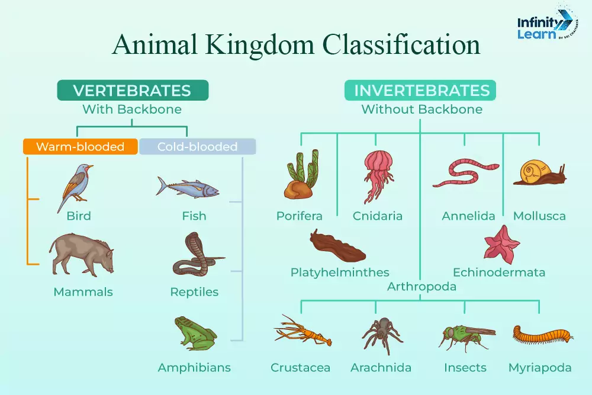
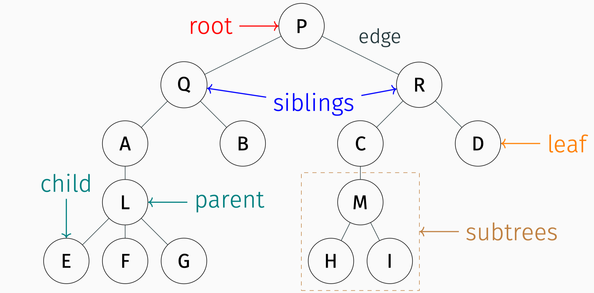

# 第7章：树和二叉树

> [!CAUTION]
> 在国内主流教材中（如《Algorithms》、《Introduction to Algorithms》），都是直接讨论二叉搜索树和平衡树（AVL树、红黑树），即教材第9章的内容；不像国内教材那样花大量篇幅介绍树的基本概念和性质。客观来说，教材中的内容存在的价值只是因为“考试”（如考研408）会考，对实际编程并没有太大帮助。

> [!TIP]
> 从编程能力的角度出发，本章仅二叉树的遍历、哈夫曼树有用。但从考试角度，每部分都重要。

## 7.1

树的最核心特征是**hierarchical**（层次的）。



树可以使用递归定义：树T要么是空树，要么是由一个根节点（root）和若干子树（subtrees）组成的。

> A tree `T` is either empty or consists of a node `r`, called the **root** of `T`, and a (possibly empty) set of subtrees whose roots are the children of `r`.

对照链表的递归定义：

> A linked list is a recursive data structure that is either empty (null) or a reference to a node having an item and a reference to a linked list.



> A path is a sequence of nodes with the property that each node in the sequence is adjacent to the node linked to it. A path that does not repeat nodes is called a **simple path**.

按教材的说法，树中结点的最大层次被称为树的**高度**（height）或树的**深度**（depth），两者是同义词。然而，在经典数据结构的书籍（如《算法导论》）中，高度的定义有所差异： **高度**（height）是从叶子节点到根节点的最长路径的边数（空树高度是-1）；以上面的树为例，教材中的说法是高度为5，而经典定义的高度为4。

>[!TIP]
> 为了考试角度的一致性，后续我们将使用教材中的定义，即树的高度等于树中结点的最大层次。


关于树的性质，可以进一步总结出：**n个结点，一定有n-1条边。**

关于“孩子兄弟链式存储结构”，在经典教材中被称为“left-child, right-sibling representation”。

## 7.2

关于二叉树与树、森林的转换是考试的重点内容。但从工程出发，它们本质还是理解树的*left-child, right-sibling representation*。

## 7.3

关于二叉树的顺序存储（即底层使用数组），最常见的做法是让root结点存在index为1的位置，左子树和右子树分别存在2i和2i+1的位置；对于i位置的结点，其父节点在 $\lfloor i/2 \rfloor$ 位置。

如果非要使用0-based indexing，那么root结点存在index为0的位置，左子树和右子树分别存在2i+1和2i+2的位置；对于i位置的结点，其父节点在 $\lfloor (i-1)/2 \rfloor$ 位置。

教材中把二叉树结点取名为`BTNode`，保存在头文件`btree.h`中。由于BTree本身是另外一种数据结构，为了避免混淆，建议把二叉树结点的结构体命名为`BinaryTreeNode`，并保存在头文件`binary_tree.h`中。

## 7.4

本小节的代码比较简单，主要是通过递归的方式进行二叉树的基本操作。唯一复杂的代码（`CreateBTree`）仅用于示例，实际编程中不太可能用到。

另一方面，该代码也能通过递归实现，从而不直接使用栈：

```c
// 辅助函数：递归解析，index 记录当前解析位置
Node* createTreeHelper(char *str, int *index) {
    if (str == NULL || str[*index] == '\0') return NULL;

    Node *node = createNode(str[*index]);
    (*index)++;

    if (str[*index] == '(') {
        (*index)++;  // 跳过 '('

        // 左子树：若当前是 ','，说明左子树为空
        if (str[*index] != ',') {
            node->left = createTreeHelper(str, index);
        }

        // 右子树：若有 ','，跳过后继续判断
        if (str[*index] == ',') {
            (*index)++;  // 跳过 ','
            if (str[*index] != ')') {
                node->right = createTreeHelper(str, index);
            }
        }

        (*index)++;  // 跳过 ')'
    }

    return node;
}

// 对外接口保持不变
Node* createTree(char *str) {
    int index = 0;
    return createTreeHelper(str, &index);
}
```

```
createTreeHelper("A(B,C)", &0)
  ├─ 创建 A，index=1
  ├─ 遇到 '('，index=2
  ├─ 递归左子树：
  │    createTreeHelper(..., &2)
  │      ├─ 创建 B，index=3
  │      └─ 遇到 ','，不是 '('，直接返回 B
  ├─ 遇到 ','，index=4
  ├─ 递归右子树：
  │    createTreeHelper(..., &4)
  │      ├─ 创建 C，index=5
  │      └─ 遇到 ')'，不是 '('，直接返回 C
  ├─ 遇到 ')'，index=6
  └─ 返回 A（A->left=B, A->right=C）
```

## 证明上面算法的正确性

（递归算法的正确性证明通常使用**数学归纳法**）

下面对树的高度进行归纳。

证明：对于任意合法的括号表示字符串`s`，`createTreeHelper(s, index)` 能正确构建对应的二叉树，且调用结束后 `*index` 恰好指向该子树字符串的末尾后一位。

- 当高度为0时，字符串为空，算法正确。
- 当高度为1时，字符串仅包含一个字符（根节点），算法正确。
- 假设对于高度不超过h的树，算法正确。那么对于高度为h的树，形如

$$
s = \underbrace{N}_{\text{根}} \underbrace{(}_{\phantom{x}} \underbrace{L}_{\text{左子树}} \underbrace{,}_{\phantom{x}} \underbrace{R}_{\text{右子树}} \underbrace{)}_{\phantom{x}}
$$

读者也可以证明其正确性。

## 7.5

参考可视化：https://bst.zhongpu.info/